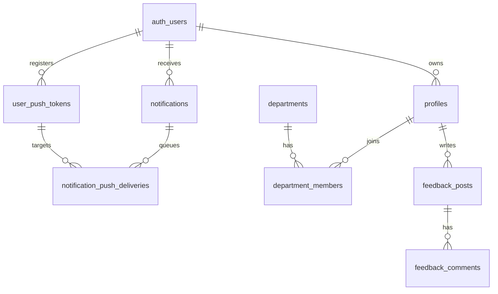

# Database

## ERD



## 주요 테이블

| 테이블 | 설명 |
|---|---|
| `profiles` | 앱 사용자 프로필과 직분/권한 |
| `members` | 교인 DB 원본/운영 회원 정보 |
| `departments` | 사역/부서 정의 |
| `department_members` | 부서 가입, 승인, 역할, 등급 |
| `notifications` | 웹/모바일 공통 알림 원장 |
| `user_push_tokens` | 사용자별 Expo push token |
| `notification_push_deliveries` | OS push 발송 큐와 감사 로그 |
| `feedback_posts`, `feedback_comments` | 피드백 게시판 |

## 알림 관련 마이그레이션

| 파일 | 역할 |
|---|---|
| `20260411400000_notifications.sql` | notifications 테이블/RPC 기본 구조 |
| `20260411800000_realtime_fix.sql` | Realtime publication 설정 |
| `20260609100000_user_push_tokens.sql` | Expo push token registry |
| `20260609110000_notification_push_deliveries.sql` | push delivery queue |
| `20260611300000_push_dispatch_webhook.sql` | delivery insert 후 dispatch API 호출 |

## 마이그레이션 방법

단일 파일 적용:

```powershell
cd C:\csh\project\chflow\MS_AX\chflow-project
npx supabase db query --linked --file supabase\migrations\20260611300000_push_dispatch_webhook.sql
```

원칙:

- schema/RPC/trigger 변경은 migration 파일로 남긴다.
- 운영 DB secret은 migration에 쓰지 않고 Supabase Vault에 저장한다.
- RLS 우회가 필요한 서버 API는 service role key를 서버 환경변수로만 사용한다.
