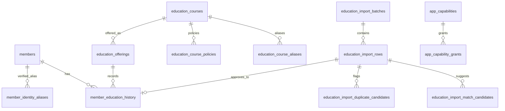

# CHFlow 삶공부·교육이력

## 조사 결과

- 웹 앱은 `chflow-app`, Supabase migration은 `MS_AX/chflow-project/supabase/migrations`에 있다.
- 실제 스택은 Next.js 16.2.10, React 19.2.7, Tailwind CSS 4.3.2, Supabase이며 패키지 매니저는 npm이다.
- 성도 테이블은 `members`, PK는 UUID `id`, 이름 검색 필드는 `name`이다. 현재 운영 성도는 2,117명이다.
- 인증 역할 값은 `admin`, `pastor`, `office`, `finance`, `leader`, `member`이다. 화면 직분 `members.sub_role`은 권한 역할과 분리되어 있다.
- 운영 DB에는 `admin` 4명, `leader` 1명, `member` 14명의 profile이 있으며 `pastor`, `office` profile은 현재 없다.
- `교육사` 직분 성도 2명이 있으나 profile 연결은 없다. `간사`, `삶공부강사` 인증 역할은 없다.
- 기존 권한은 `get_user_role()`, `assert_staff()` 및 RLS를 사용하며 범용 capability 체계와 범용 감사 로그는 없었다.
- 기존 빈 `life_studies`, `life_study_enrollments` 테이블은 변경하지 않았다.
- 원본 HWPX 두 파일은 저장소 밖에 있고 Git 추적 대상이 아니다. 기존 공개 HWPX 템플릿 때문에 전역 `*.hwpx` ignore 대신 `private/import/`만 제외한다.

## 구조와 보안



로그인 사용자는 `public_member_education_history_view`와 공개 조회 RPC만 읽는다. 이 경로에는 연락처, 생년월일, 가족관계, 증서번호, 원본 파일·행, 검수 메모, 후보 점수가 없다. 원본 행과 매칭 후보, 감사 로그는 capability가 있는 사용자에게만 RLS가 허용한다. 모든 변경 API는 bearer token을 검증한 뒤 capability를 다시 조회하며 DB RPC/RLS도 같은 권한을 재검증한다.

초기 capability:

- 모든 로그인 사용자: `education_history.read`
- `admin`, `pastor`, `office`: manage/import/approve/course.manage
- `members.sub_role`이 `교육사`, `간사`, `삶공부강사`: manage/import/approve/course.manage
- `admin`: audit.read

새 역할은 화면 코드를 수정하지 않고 grant만 추가한다.

```sql
insert into app_capability_grants(capability_key, principal_type, principal_value)
values ('education_history.manage', 'member_sub_role', '새직분')
on conflict do nothing;
```

## Migration과 배포

적용 순서:

1. `20260729200000_education_history_foundation.sql`
2. `20260729201000_education_history_security.sql`
3. `20260729202000_education_history_seed.sql`
4. `20260729203000_education_history_queries.sql`
5. `20260729204000_education_candidate_search.sql`
6. `20260729205000_education_import_uuid_aggregate_fix.sql`
7. `20260729206000_education_import_bulk_runtime.sql`
8. `20260729207000_education_audit_trigger_guard.sql`
9. `20260730200000_education_review_page.sql`

운영 전 staging에서 `supabase db lint`, RLS 권한 테스트, 두 dry-run을 다시 수행한다. 이후 migration을 적용하고 웹 앱을 배포한다. 원본 HWPX와 `private/import` 출력은 배포 artifact나 공개 Storage에 포함하지 않는다.

롤백은 먼저 `education_*` 테이블을 백업한 뒤
`MS_AX/chflow-project/supabase/rollbacks/20260729200000_education_history.sql`을 실행한다. 정식 이력 삭제가 포함된 수동 롤백이므로 사전 백업 없이 실행하지 않는다.

## 파싱·가져오기

파서는 `hp:tbl → hp:tr → hp:tc` 구조와 `cellAddr`, `cellSpan`, `hp:t`를 읽는다. 일반 명부와 LMTC는 열 매핑을 별도로 처리한다. LMTC 실제 문서는 7열이 아닌 6열이며, 기수는 과정 열에서, 상태는 비고 열에서 추출한다.

```powershell
cd C:\csh\chflow-education\chflow-app
npm run education:import -- --file="<일반명부.hwpx>" --type=general --dry-run --env-file=".env.local"
npm run education:import -- --file="<LMTC.hwpx>" --type=lmtc --dry-run --env-file=".env.local"
```

실제 임시 적재는 승인 권한 사용자의 access token을 `EDUCATION_IMPORT_ACCESS_TOKEN`에 넣고 `--dry-run`만 제거한다. 이 명령은 정식 이력을 만들지 않고 import batch/row만 만든다.

```powershell
$env:EDUCATION_IMPORT_ACCESS_TOKEN="<로그인 access token>"
npm run education:import -- --file="<원본.hwpx>" --type=general --env-file=".env.local"
```

웹의 “자료 가져오기”도 같은 staging RPC만 호출한다. 추천 매칭은 승인하지 않으며, 동명이인·유사 이름·미등록 성도는 수동 검수 대상이다. `applied` 행은 승인 RPC에서 정식 이력 반영이 차단된다.

## 2026-07-29 dry-run 결과

| 항목 | 일반 명부 | LMTC |
|---|---:|---:|
| 표 | 153 | 21 |
| 전체 추출 행 | 3,281 | 466 |
| 반복 헤더 | 153 | 21 |
| 빈 행 | 31 | 5 |
| 제목 등 비데이터 | 0 | 1 |
| 유효 데이터 | 3,097 | 439 |
| 이름 정규화 성공 | 3,077 | 438 |
| 이름 검수 필요 | 20 | 1 |
| 괄호 표기 | 62 | 26 |
| 직분 분리 | 673 | 258 |
| 날짜 변환 성공 | 3,069 | 413 |
| 날짜 실패 | 0 | 0 |
| 날짜 공란 | 28 | 26 |
| 신청 | 16 | 0 |
| 수료 | 3,014 | 168 |
| 이수 | 67 | 245 |
| 교육 | 0 | 2 |
| 상태 미기재 | 0 | 24 |
| 과정 원본명 종류 | 266 | 41 |
| 표준 과정 자동 추천 | 2,951 | 439 |
| 과정 미분류 | 146 | 0 |
| 성도 단일 후보 | 1,989 | 241 |
| 동명이인 후보 | 112 | 13 |
| 미등록 후보 | 996 | 185 |
| 원본 내부 중복 의심 | 0 | 1 |

최초 dry-run 시점에는 검증 별칭이 없어 현재 성도의 정확한 이름만 사용했다. 이후 관리자가 저장한 검증 별칭은 다음 import부터 추천 후보에 포함된다. 일반 명부 예상 “3,000건 이상”, LMTC 예상 “400건 이상”과 일치한다. LMTC 전체 466행과 데이터 439행 차이는 헤더 21, 빈 행 5, 표 제목 1행이다.

## 2026-07-29 운영 staging 결과

- 모든 migration을 원격 Supabase에 적용했다.
- 일반 명부 batch: `d4aa8e48-3e4a-4798-997e-5923faa6896b`
- LMTC batch: `415c8594-10ac-4288-9f54-b5eb53d72832`
- staging 원본 행: 3,536건
- 추천 매칭: 2,230건
- 동명이인: 125건
- 미등록: 1,181건
- 과정 자동 추천: 3,390건
- 과정 미분류: 146건
- 날짜 parsed/partial/blank: 3,442/40/54건
- 중복 의심: 2건
- 정식 `member_education_history`: 0건
- 검수 화면은 50건 단위 서버 페이지네이션과 상태·배치·검색 필터를 사용한다.
- 한 번의 선택 작업은 최대 50건이며 행별 성공·실패 결과를 반환한다.

비로그인은 공개 통계 RPC가 `42501`로 차단됐다. 일반 성도 세션은
`education_history.read`만 받았고 공개 통계 조회는 성공했으며, 원본 import
행은 0건으로 가려지고 과정 쓰기는 `42501`로 거부됐다.

## 운영 승인 체크리스트

- migration 백업과 staging lint
- 비로그인 공개 view/RPC 거부
- 일반 성도 공개 이력 조회 및 원본/증서번호 차단
- 관리자·교육 담당자의 import/review/approve/course 권한
- 동일 파일 hash 재업로드가 duplicate batch로 남는지 확인
- 동명이인과 유사 이름이 자동 승인되지 않는지 확인
- 신청 상태 승인 거부, 승인 취소 soft delete, 감사 로그 확인
- 어린이·청소년 과정이 성인 기본필수에 포함되지 않는지 확인
- 원본 HWPX와 preview가 Git/배포/공개 Storage에 없는지 확인

